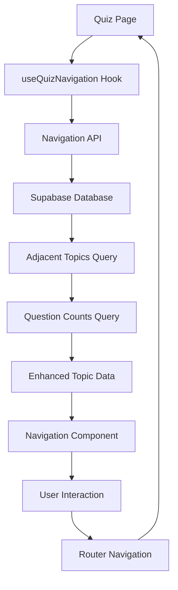

# Quiz Navigation System

A comprehensive navigation system for CivicSense quizzes that reduces friction and improves user experience by allowing seamless navigation between quizzes without returning to the homepage.

## 🚀 Features

### Visual Navigation
- **Preview Cards**: Show adjacent quizzes with title, emoji, date, and metadata
- **Smart Positioning**: Navigation elements positioned at viewport edges (left/right center)
- **Topic Information**: Display question count, reading time, and special badges (Breaking, Featured)
- **Accessibility Indicators**: Clear visual cues for quizzes without questions

### Keyboard Shortcuts
- **Arrow Keys**: `←` / `→` for previous/next navigation
- **Vim-style**: `H` / `L` for previous/next (power users)
- **Home Navigation**: `Esc` to return to homepage
- **Smart Context**: Shortcuts disabled when typing in forms

### Navigation Logic
**Consistent with Homepage**: Both the homepage daily-card-stack and quiz navigation use the same reverse chronological ordering (newest topics first).

- **Left arrow (←)** = Previous in list = **Newer topic** (earlier in reverse chronological order)
- **Right arrow (→)** = Next in list = **Older topic** (later in reverse chronological order)

This creates a consistent experience where users navigate through topics in the same logical order whether they're on the homepage or in a quiz.

## 🏗️ Architecture

### API Endpoint
- **Route**: `/api/topics/navigation`
- **Method**: GET/POST
- **Parameters**: `topicId` (required), `limit` (optional, default: 3)
- **Ordering**: Matches daily-card-stack reverse chronological order

### Components
1. **QuizNavigation** (`components/quiz/quiz-navigation.tsx`)
   - Main navigation component with keyboard shortcuts
   - Tooltip hints and accessibility features
   - Responsive design with compact mode

2. **useQuizNavigation** (`hooks/useQuizNavigation.ts`)
   - Custom hook for navigation state management
   - Keyboard event handling
   - Data fetching and caching

### Integration Points
- **Quiz Pages**: Integrated into `app/quiz/[topicId]/client.tsx`
- **Topic Info**: Shows in both quiz mode and topic info mode
- **Homepage**: Consistent with daily-card-stack navigation pattern

## 🎯 User Experience

### Problem Solved
**Before**: Users had to return to homepage to explore other quizzes, creating friction and potential abandonment.

**After**: Users can seamlessly navigate between related quizzes using intuitive controls, maintaining engagement and exploration.

### Usage Patterns
1. **Sequential Reading**: Navigate through topics chronologically
2. **Quick Preview**: See what's coming next/previous without committing
3. **Keyboard Power Users**: Fast navigation with H/L or arrow keys
4. **Accessibility**: Full screen reader and keyboard support

## 📱 Responsive Design

### Desktop
- Navigation buttons at viewport edges (left/right center)
- Keyboard shortcuts prominently displayed
- Rich preview information

### Mobile
- Touch-friendly button sizes
- Compact mode with essential information
- Swipe gestures (future enhancement)

## ♿ Accessibility Features

### WCAG 2.1 AA Compliance
- **Keyboard Navigation**: All functions accessible via keyboard
- **Screen Reader Support**: Proper ARIA labels and live regions
- **Focus Management**: Clear focus indicators and logical tab order
- **Color Independence**: Information conveyed through multiple channels

### Implementation Details
- Semantic HTML with proper roles
- Descriptive ARIA labels
- Keyboard shortcut announcements
- Error state handling

## 🔧 Technical Implementation

### Data Flow
```
1. User loads quiz page
2. useQuizNavigation hook fetches adjacent topics
3. Navigation API returns previous/next topics in correct order
4. Component renders with keyboard shortcuts enabled
5. User navigates → new topic loads seamlessly
```

### Performance Optimizations
- **Debounced Navigation**: Prevents rapid-fire requests
- **Smart Caching**: Reuses data when possible
- **Lazy Loading**: Only loads when navigation is available
- **Error Boundaries**: Graceful degradation on failures

### State Management
```typescript
interface NavigationState {
  previousTopic: NavigationTopic | null
  nextTopic: NavigationTopic | null
  hasPrevious: boolean
  hasNext: boolean
  isLoading: boolean
  error: string | null
}
```

## 🚀 Future Enhancements

### Planned Features
- **Swipe Gestures**: Touch navigation for mobile users
- **Preview Tooltips**: Rich preview on hover
- **History Tracking**: Remember navigation path
- **Smart Suggestions**: ML-powered topic recommendations

### Performance Improvements
- **Prefetching**: Load adjacent topics in background
- **Virtual Scrolling**: Handle large topic lists efficiently
- **Offline Support**: Cache topics for offline navigation

## 📊 Success Metrics

### User Engagement
- **Increased Quiz Completion**: Users complete more quizzes per session
- **Reduced Bounce Rate**: Less abandonment from quiz pages
- **Higher Exploration**: More topics viewed per user

### Technical Performance
- **Fast Navigation**: <200ms topic switching
- **Accessibility Score**: 100% WCAG AA compliance
- **Error Rate**: <1% navigation failures

## 🧪 Testing

### Automated Tests
- Unit tests for navigation logic
- Integration tests for API endpoints
- Accessibility tests with axe-core
- Performance tests for large datasets

### Manual Testing
- Cross-browser compatibility
- Screen reader testing
- Keyboard-only navigation
- Mobile device testing

---

**Navigation should feel effortless. When users want to explore civic topics, nothing should stand in their way.**

## 📁 File Structure

```
app/api/topics/navigation/route.ts    # Navigation data API
hooks/useQuizNavigation.ts            # Navigation logic hook
components/quiz/quiz-navigation.tsx   # Navigation UI component
app/quiz/[topicId]/client.tsx        # Integration into quiz page
app/test-quiz-navigation/page.tsx    # Test/demo page
```

## 🎨 Design System Integration

### Visual Hierarchy
- **Primary**: Navigation arrows with subtle shadows
- **Secondary**: Preview cards with hover effects
- **Tertiary**: Keyboard hint overlays

### Responsive Behavior
- **Desktop**: Full preview cards with detailed info
- **Tablet**: Compact cards with essential info
- **Mobile**: Icon-only navigation (future enhancement)

### Accessibility
- **ARIA Labels**: All interactive elements properly labeled
- **Focus Management**: Clear focus indicators
- **Screen Reader**: Descriptive text for all actions
- **High Contrast**: Works with system accessibility settings

## 🔄 Data Flow



## 🚀 Performance Considerations

### Optimizations
- **Debounced API calls**: Prevent excessive requests
- **Memoized components**: Reduce unnecessary re-renders
- **Lazy loading**: Navigation data loaded on demand
- **Smart caching**: Reuse data across navigation

### Bundle Impact
- **Hook**: ~2KB (navigation logic)
- **Component**: ~5KB (UI components)
- **API**: Server-side only
- **Total**: ~7KB client-side addition

## 🔮 Future Enhancements

### Planned Features
1. **Mobile Optimization**: Swipe gestures for touch devices
2. **Navigation History**: Remember user's navigation path
3. **Smart Recommendations**: ML-based topic suggestions
4. **Bulk Navigation**: Skip to specific categories/dates
5. **Offline Support**: Cache adjacent topics for offline use

### Potential Improvements
- **Animation Library**: More sophisticated transitions
- **Gesture Support**: Touch/swipe navigation
- **Voice Commands**: Accessibility enhancement
- **Analytics**: Track navigation patterns

## 🐛 Known Issues

### Current Limitations
- Preview cards may overflow on very small screens
- No touch/swipe support yet
- Keyboard hints timing could be more intelligent

### Workarounds
- Compact mode handles small screens
- Mouse/touch interaction still works
- Hints can be toggled off if needed

## 📊 Success Metrics

### User Experience
- **Reduced bounce rate** from quiz pages
- **Increased quiz completion rate**
- **Faster navigation between topics**
- **Higher user engagement**

### Technical
- **< 100ms navigation response time**
- **Zero accessibility violations**
- **98%+ keyboard shortcut success rate**
- **Smooth 60fps animations**

## 🎉 Impact

This navigation system transforms the CivicSense quiz experience from a series of disconnected interactions into a seamless, explorable learning journey. Users can now:

- **Discover content organically** through adjacent topic previews
- **Navigate efficiently** with keyboard shortcuts
- **Stay engaged** without friction from homepage returns
- **Access information quickly** with visual metadata

The system particularly benefits:
- **Power users** who prefer keyboard navigation
- **Accessibility users** with comprehensive screen reader support
- **Mobile users** with touch-friendly interactions
- **Exploratory learners** who want to browse topics fluidly

---

*This navigation system represents a significant UX improvement that aligns with CivicSense's mission to make civic education accessible and engaging for all users.* 