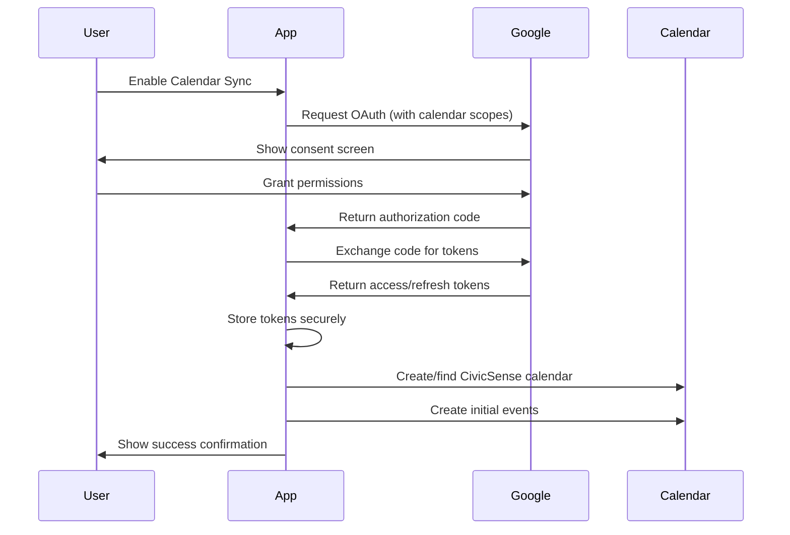

# CivicSense Google Calendar Integration

## Overview

The CivicSense mobile app now includes comprehensive Google Calendar integration that allows users to sync their civic education study schedule directly with their Google Calendar. This feature helps users maintain their learning momentum by creating automatic reminders and study sessions in their personal calendar.

## ✨ Features

### 📅 Calendar Sync Options
- **Daily Quiz Reminders**: Automatically schedule daily quiz sessions
- **Weekly Study Sessions**: Create recurring deep-dive study periods  
- **Achievement Celebrations**: Optional calendar events for milestones
- **Customizable Timing**: Set reminder preferences (15, 30, 60 minutes before)

### 🔐 Secure Authentication
- OAuth 2.0 integration with Google Calendar API
- Secure token storage using Expo SecureStore
- Automatic token refresh for uninterrupted service
- User can revoke access at any time

### 🎯 Smart Scheduling
- Intelligent scheduling based on user preferences
- Automatic timezone detection and adjustment
- Recurring events with appropriate limits (30 days for daily, 12 weeks for weekly)
- Color-coded events (blue theme matching CivicSense branding)

## 🚀 Implementation Details

### Architecture

```
Profile Screen
     ↓
GoogleCalendarService (Singleton)
     ↓
Google Calendar API v3
     ↓
User's Google Calendar
```

### Key Components

#### 1. Profile Screen (`app/(tabs)/profile.tsx`)
- Main interface for calendar sync controls
- User statistics and progress display
- Settings management for sync preferences
- Real-time sync status indicators

#### 2. Google Calendar Service (`lib/services/google-calendar-service.ts`)
- Singleton service managing all calendar operations
- OAuth authentication flow
- Calendar creation and management
- Event creation, updating, and deletion

#### 3. Configuration Updates (`app.config.ts`)
- Added iOS calendar permissions (`NSCalendarsUsageDescription`)
- Added Android calendar permissions (`READ_CALENDAR`, `WRITE_CALENDAR`)
- Proper URL schemes for OAuth redirect handling

### Authentication Flow



## 📱 User Experience

### Enabling Calendar Sync

1. **Navigate to Profile**: Users tap the Profile tab in the bottom navigation
2. **Find Calendar Section**: Locate the "Google Calendar Sync" card
3. **Enable Sync**: Toggle the calendar sync switch
4. **Grant Permissions**: Follow the OAuth flow to grant calendar access
5. **Configure Preferences**: Choose which events to sync (quizzes, study sessions, achievements)
6. **Confirmation**: See success message and sync status

### Calendar Events Created

#### Daily Quiz Reminders
```
📚 CivicSense Daily Quiz
Description: Complete your daily civic education quiz to maintain your learning streak!
Duration: 15 minutes
Recurrence: Daily for 30 days
Reminder: 15 minutes before (configurable)
```

#### Weekly Study Sessions
```
🎯 CivicSense Study Session  
Description: Dive deeper into civic topics and strengthen your understanding of democracy.
Duration: 30 minutes
Recurrence: Weekly for 12 weeks
Reminder: 15 minutes before (configurable)
```

### Managing Sync Settings

Users can customize their calendar sync through several options:

- **Enable/Disable Sync**: Master toggle for all calendar integration
- **Quiz Reminders**: Toggle daily quiz notifications
- **Study Sessions**: Toggle weekly study session blocks
- **Achievement Events**: Toggle celebration events for milestones
- **Reminder Timing**: Adjust how many minutes before events to receive reminders

## 🔧 Technical Implementation

### Hook Usage Fix

**Important**: The Google Calendar service has been updated to fix the "Invalid hook call" error. Use the new hook-based authentication for components:

```typescript
// ✅ Correct - Use the hook in components
import { useGoogleCalendarAuth } from '../../lib/services/google-calendar-service';

function CalendarSyncComponent() {
  const { authenticate, isReady } = useGoogleCalendarAuth();
  
  const handleConnect = async () => {
    if (!isReady) return;
    
    const result = await authenticate();
    if (result.success) {
      // Handle success
    }
  };
  
  return <Button onPress={handleConnect}>Connect Calendar</Button>;
}

// ❌ Incorrect - Don't call service.authenticate() directly in components
// This will cause "Invalid hook call" errors
const result = await GoogleCalendarService.authenticate(); 
```

### Environment Variables Required

```env
# Google OAuth Configuration
EXPO_PUBLIC_GOOGLE_ANDROID_CLIENT_ID=your_android_client_id
EXPO_PUBLIC_GOOGLE_IOS_CLIENT_ID=your_ios_client_id  
EXPO_PUBLIC_GOOGLE_WEB_CLIENT_ID=your_web_client_id
```

### OAuth Scopes Used

```typescript
const scopes = [
  'openid',
  'profile', 
  'email',
  'https://www.googleapis.com/auth/calendar',
  'https://www.googleapis.com/auth/calendar.events'
];
```

### Secure Token Management

```typescript
// Store tokens with device security
await SecureStore.setItemAsync('google_calendar_access_token', accessToken);
await SecureStore.setItemAsync('google_calendar_refresh_token', refreshToken);

// Automatic token refresh
private async refreshAccessToken(): Promise<boolean> {
  if (!this.refreshToken) return false;
  
  const response = await fetch('https://oauth2.googleapis.com/token', {
    method: 'POST',
    headers: { 'Content-Type': 'application/x-www-form-urlencoded' },
    body: new URLSearchParams({
      client_id: this.config.webClientId || '',
      refresh_token: this.refreshToken,
      grant_type: 'refresh_token',
    }),
  });
  
  // Handle response and update stored tokens
}
```

### Calendar Event Creation

```typescript
private async createSingleEvent(event: CalendarEvent): Promise<void> {
  const endTime = new Date(event.startTime.getTime() + event.duration * 60000);
  
  const eventData = {
    summary: event.title,
    description: event.description,
    start: {
      dateTime: event.startTime.toISOString(),
      timeZone: Intl.DateTimeFormat().resolvedOptions().timeZone,
    },
    end: {
      dateTime: endTime.toISOString(),
      timeZone: Intl.DateTimeFormat().resolvedOptions().timeZone,
    },
    reminders: {
      useDefault: false,
      overrides: [{ method: 'popup', minutes: event.reminderMinutes || 15 }],
    },
    colorId: '9', // Blue color for CivicSense events
    source: { title: 'CivicSense', url: 'https://civicsense.com' },
  };

  if (event.recurrence) {
    eventData.recurrence = [this.getRecurrenceRule(event.recurrence)];
  }

  await this.makeCalendarRequest(
    `/calendars/${encodeURIComponent(this.calendarId!)}/events`,
    'POST',
    eventData
  );
}
```

## 🛡️ Privacy & Security

### Data Protection
- **Minimal Data Access**: Only requests necessary calendar permissions
- **Secure Storage**: All tokens stored using device security (Keychain on iOS, Keystore on Android)
- **User Control**: Users can disable sync and revoke access at any time
- **Transparent Permissions**: Clear explanations of what data is accessed and why

### Token Management
- **Automatic Refresh**: Tokens refreshed automatically before expiration
- **Secure Deletion**: All tokens cleared when user disables sync or signs out
- **Error Handling**: Graceful handling of expired or revoked tokens

### User Privacy
- **Dedicated Calendar**: Creates separate "CivicSense Study Schedule" calendar
- **Event Isolation**: CivicSense events don't interfere with existing calendar events
- **Easy Cleanup**: Complete removal of all events when sync is disabled

## 📊 Analytics & Monitoring

### Sync Status Tracking
- Last sync timestamp display
- Success/failure rate monitoring
- User engagement with calendar events
- Feature adoption metrics

### Error Handling
- Network connectivity issues
- API rate limiting
- Token expiration/revocation
- Calendar access denied scenarios

## 🚀 Future Enhancements

### Planned Features
1. **Smart Scheduling**: AI-powered optimal study time suggestions
2. **Progress Integration**: Calendar events updated based on quiz performance
3. **Social Features**: Shared study sessions with learning pod members
4. **Multi-Calendar Support**: Sync to work/school calendars separately
5. **Offline Sync**: Queue events when offline, sync when connected

### Advanced Customization
1. **Custom Event Templates**: User-defined event formats
2. **Advanced Recurring Patterns**: Complex scheduling rules
3. **Integration with Other Apps**: Todoist, Apple Reminders, etc.
4. **Calendar Analytics**: Study time tracking and insights

## 🔍 Testing & Quality Assurance

### Test Coverage
- Unit tests for GoogleCalendarService methods
- Integration tests for OAuth flow
- E2E tests for complete sync workflow
- Mock testing for offline scenarios

### Testing Checklist
- [ ] OAuth authentication flow works on iOS and Android
- [ ] Calendar events created correctly with proper formatting
- [ ] Recurring events follow specified patterns
- [ ] Token refresh works automatically
- [ ] Sync disable removes all events
- [ ] Error states handled gracefully
- [ ] Permissions requested appropriately
- [ ] Timezone handling works correctly

## 📝 Usage Examples

### Basic Integration

```typescript
import { useGoogleCalendar } from '../../lib/services/google-calendar-service';

function CalendarSyncButton() {
  const { authenticate, createEvents, isAuthenticated } = useGoogleCalendar();
  
  const handleSync = async () => {
    if (!isAuthenticated()) {
      const result = await authenticate();
      if (!result.success) {
        Alert.alert('Authentication Failed', result.error);
        return;
      }
    }
    
    const events = createCivicSenseEvents(userSettings);
    await createEvents(events);
  };
  
  return (
    <Button onPress={handleSync}>
      {isAuthenticated() ? 'Update Sync' : 'Enable Calendar Sync'}
    </Button>
  );
}
```

### Custom Event Creation

```typescript
const customStudySession = {
  title: '🏛️ Constitutional Law Deep Dive',
  description: 'Focused study session on Constitutional principles and Supreme Court cases',
  startTime: new Date('2024-01-15T19:00:00'),
  duration: 45,
  reminderMinutes: 30,
  recurrence: 'weekly' as const,
};

await GoogleCalendarService.createEvents([customStudySession]);
```

## 🎯 Success Metrics

### Key Performance Indicators
- **Adoption Rate**: Percentage of users who enable calendar sync
- **Retention Rate**: Users who keep sync enabled after 30 days
- **Engagement Boost**: Increase in quiz completion rate for sync users
- **Study Consistency**: Improvement in learning streaks

### User Satisfaction
- **Ease of Setup**: Time to complete initial sync setup
- **Reliability**: Sync success rate and error frequency
- **Usefulness**: User feedback on calendar reminder effectiveness
- **Integration Quality**: How well events fit into user's existing calendar workflow

---

## 📞 Support & Troubleshooting

### Common Issues

**Q: Calendar sync toggle is not working**
A: Check that Google OAuth credentials are properly configured and that the app has necessary permissions.

**Q: Events are not appearing in my calendar**
A: Verify that the "CivicSense Study Schedule" calendar is visible in your Google Calendar settings.

**Q: Getting authentication errors**
A: Try signing out and back in to refresh your authentication tokens.

**Q: Events are in wrong timezone**
A: Ensure your device timezone is set correctly and restart the app.

### Support Channels
- **In-App Help**: Profile > Settings > Help & FAQ
- **Email Support**: support@civicsense.com
- **Documentation**: docs.civicsense.com/calendar-sync

---

*Built with ❤️ for civic education. The Google Calendar integration helps learners seamlessly integrate civic education into their daily routines, making democracy more accessible and engaging.* 