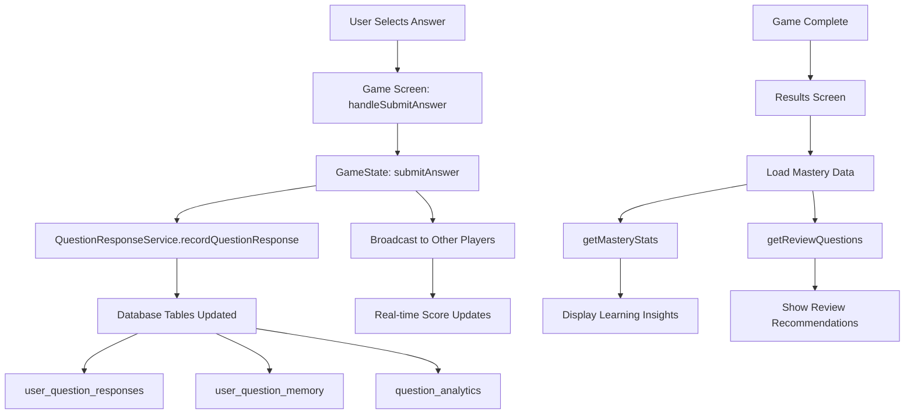

# Multiplayer Question Response Integration Guide

> **CivicSense Mission**: Every multiplayer interaction should advance democratic participation by tracking learning progress and revealing civic knowledge mastery.

## 📋 Table of Contents
1. [Integration Overview](#integration-overview)
2. [Game State Integration](#game-state-integration)
3. [Multiplayer Game Screen Updates](#multiplayer-game-screen-updates)
4. [Results Screen Enhancements](#results-screen-enhancements)
5. [Data Flow Architecture](#data-flow-architecture)
6. [Implementation Examples](#implementation-examples)
7. [Benefits & Features](#benefits--features)

---

## 1. Integration Overview

The `QuestionResponseService` has been integrated into the multiplayer game system to provide:

- **Real-time response tracking** during multiplayer quizzes
- **Spaced repetition scheduling** for questions answered in multiplayer games
- **Mastery level calculation** based on multiplayer performance
- **Post-game analytics** showing learning progress and review recommendations
- **Cross-game learning continuity** (multiplayer responses feed into personal learning)

### Key Integration Points:

```typescript
// 1. Game State (lib/multiplayer/game-state.ts)
import { QuestionResponseService, type QuestionResponseData } from '../services/question-response-service';

// 2. Game Screen (app/multiplayer/game/[code].tsx)
import { useQuestionResponse } from '../../../lib/services/question-response-service';

// 3. Results Screen (app/multiplayer/results/[code].tsx)
import { useQuestionResponse } from '../../../lib/services/question-response-service';
```

---

## 2. Game State Integration

### Enhanced `submitAnswer` Method

The `MultiplayerGameState.submitAnswer()` method now includes comprehensive response tracking:

```typescript
// lib/multiplayer/game-state.ts
async submitAnswer(answer: string, confidenceLevel: number = 3): Promise<void> {
  if (this.gameState.status !== 'in_progress') return;

  const currentQuestion = this.gameState.questions[this.gameState.currentQuestionIndex];
  if (!currentQuestion) return;

  const isCorrect = answer === currentQuestion.correctAnswer;
  const timeSpent = this.gameState.settings.timePerQuestion - this.gameState.timeRemaining;

  // Update local score immediately for responsive UI
  if (isCorrect) {
    const currentPlayer = this.getCurrentPlayer();
    if (currentPlayer) {
      currentPlayer.score += 1;
    }
  }

  // Record the response using QuestionResponseService
  let masteryLevel: number | undefined;
  try {
    const responseData: QuestionResponseData = {
      questionId: currentQuestion.id,
      selectedAnswer: answer,
      isCorrect,
      responseTimeMs: timeSpent * 1000, // Convert to milliseconds
      assessmentType: 'quiz', // Multiplayer treated as quiz assessment
      topicId: currentQuestion.topic_id,
      confidenceLevel,
      wasReview: false
    };

    const result = await QuestionResponseService.recordQuestionResponse(this.userId, responseData);
    
    if (result.success) {
      masteryLevel = result.masteryLevel;
      console.log('✅ Multiplayer answer recorded:', {
        masteryLevel: result.masteryLevel,
        nextReviewDate: result.nextReviewDate
      });
    } else {
      console.error('❌ Failed to record multiplayer answer:', result.error);
    }
  } catch (error) {
    console.error('❌ Error recording multiplayer answer:', error);
    // Don't block the game flow for tracking failures
  }

  // Broadcast the answer with mastery data
  this.broadcastPlayerAction({
    type: 'answer',
    payload: {
      answer,
      timeSpent,
      isCorrect,
      questionId: currentQuestion.id,
      masteryData: masteryLevel // Include mastery data for other players
    }
  });
}
```

### Key Features:

- **Graceful Error Handling**: Response tracking failures don't block game flow
- **Mastery Tracking**: Each answer contributes to long-term learning analytics
- **Spaced Repetition**: Incorrect answers are automatically scheduled for review
- **Multiplayer Context**: Responses are tagged with multiplayer assessment type

---

## 3. Multiplayer Game Screen Updates

### Enhanced Answer Submission

The game screen now uses the updated `submitAnswer` method with async handling:

```typescript
// app/multiplayer/game/[code].tsx
export default function MultiplayerGameScreen() {
  const { recordResponse } = useQuestionResponse();
  
  const handleSubmitAnswer = useCallback(async () => {
    if (!selectedAnswer || hasAnswered || !gameManagerRef.current || !user?.id) return;

    const startTime = Date.now();
    
    // Use the game manager's updated submitAnswer method which includes QuestionResponseService
    try {
      await gameManagerRef.current.submitAnswer(selectedAnswer, 4); // Default confidence level
      setHasAnswered(true);
    } catch (error) {
      console.error('Error submitting answer:', error);
      // Still mark as answered to prevent multiple submissions
      setHasAnswered(true);
    }
    
    // Track performance (if performanceMonitor is available)
    try {
      performanceMonitor.trackLatency('answer_submit', startTime);
    } catch (error) {
      // Ignore if performanceMonitor is not available
    }
  }, [selectedAnswer, hasAnswered, user?.id]);
  
  // ... rest of component
}
```

### User Experience Improvements:

- **Responsive UI**: Local score updates happen immediately
- **Error Resilience**: Tracking failures don't affect game experience
- **Performance Monitoring**: Latency tracking for optimization
- **Confidence Levels**: Default confidence can be enhanced with UI sliders

---

## 4. Results Screen Enhancements

### Post-Game Mastery Analytics

The results screen now shows comprehensive learning insights:

```typescript
// app/multiplayer/results/[code].tsx
export default function MultiplayerResultsScreen() {
  const { getMasteryStats, getReviewQuestions } = useQuestionResponse();
  const [masteryData, setMasteryData] = useState<any>(null);

  const loadResults = async () => {
    try {
      setLoading(true);
      
      // Load user's mastery data from QuestionResponseService
      if (user?.id) {
        try {
          const [masteryStats, reviewQuestions] = await Promise.all([
            getMasteryStats(user.id),
            getReviewQuestions(user.id, 5)
          ]);
          
          setMasteryData({
            masteryStats,
            reviewQuestions,
            hasData: true
          });
          
          console.log('✅ Loaded post-game mastery data:', {
            masteryStats,
            reviewQuestions: reviewQuestions.length
          });
        } catch (error) {
          console.error('❌ Failed to load mastery data:', error);
          setMasteryData({ hasData: false });
        }
      }
      
      // ... load game results
    } catch (error) {
      // ... error handling
    }
  };

  // ... rest of component
}
```

### New Results Components:

```jsx
{/* Post-Game Mastery Insights */}
{masteryData?.hasData && (
  <View style={styles.section}>
    <AnimatedCard style={styles.masteryInsightsCard} variant="outlined" delay={600}>
      <View style={styles.masteryHeader}>
        <Text style={styles.masteryTitle}>🎯 Your Learning Progress</Text>
        <Text style={[styles.masterySubtitle, { color: theme.foregroundSecondary }]}>
          Based on your question responses
        </Text>
      </View>

      {masteryData.reviewQuestions?.length > 0 && (
        <View style={styles.reviewSection}>
          <Text style={styles.reviewTitle}>📚 Questions to Review</Text>
          <Text style={[styles.reviewDescription, { color: theme.foregroundSecondary }]}>
            {masteryData.reviewQuestions.length} questions are ready for spaced repetition review
          </Text>
          <TouchableOpacity 
            style={[styles.reviewButton, { backgroundColor: theme.primary }]}
            onPress={() => router.push('/review-session' as any)}
          >
            <Text style={styles.reviewButtonText}>Start Review Session</Text>
          </TouchableOpacity>
        </View>
      )}

      {masteryData.masteryStats && (
        <View style={styles.masteryStatsSection}>
          <Text style={styles.masteryStatsTitle}>📈 Knowledge Mastery</Text>
          <Text style={[styles.masteryStatsDescription, { color: theme.foregroundSecondary }]}>
            Your understanding is growing stronger with each game
          </Text>
        </View>
      )}
    </AnimatedCard>
  </View>
)}
```

---

## 5. Data Flow Architecture

### Multiplayer Response Flow:



### Database Impact:

| Table | What Gets Updated | When |
|-------|------------------|------|
| `user_question_responses` | Every multiplayer answer | Real-time during game |
| `user_question_memory` | Spaced repetition scheduling | After each response |
| `question_analytics` | Question difficulty metrics | Aggregated periodically |
| `multiplayer_question_responses` | Multiplayer-specific data | Real-time during game |

---

## 6. Implementation Examples

### Example 1: Basic Multiplayer Answer Tracking

```typescript
// In a multiplayer quiz component
const handleAnswerSubmit = async (answer: string) => {
  // The game state handles all the tracking automatically
  await gameManager.submitAnswer(answer, userConfidenceLevel);
  
  // UI updates happen automatically via real-time subscriptions
  // No additional tracking code needed in the component
};
```

### Example 2: Post-Game Review Session

```typescript
// After multiplayer game completion
const showReviewRecommendations = async () => {
  const reviewQuestions = await getReviewQuestions(user.id, 10);
  
  if (reviewQuestions.length > 0) {
    Alert.alert(
      'Ready for Review!',
      `You have ${reviewQuestions.length} questions ready for spaced repetition review. This will help strengthen your civic knowledge.`,
      [
        { text: 'Later', style: 'cancel' },
        { text: 'Start Review', onPress: () => router.push('/review-session') }
      ]
    );
  }
};
```

### Example 3: Mastery-Based Multiplayer Matching

```typescript
// Future enhancement: Match players by mastery level
const findMultiplayerMatch = async (topicId: string) => {
  const userMastery = await getMasteryStats(user.id);
  const topicMastery = userMastery?.topics?.[topicId] || 0;
  
  // Find players with similar mastery levels (±20%)
  const matchingPlayers = await findPlayersWithMastery(topicId, topicMastery, 20);
  
  return matchingPlayers;
};
```

---

## 7. Benefits & Features

### For Users:
- **Continuous Learning**: Multiplayer games contribute to personal learning progress
- **Spaced Repetition**: Missed questions automatically scheduled for review
- **Mastery Tracking**: See how multiplayer performance affects overall knowledge
- **Actionable Insights**: Clear next steps for improving civic knowledge

### For CivicSense Platform:
- **Comprehensive Analytics**: Understand how multiplayer affects learning outcomes
- **Content Optimization**: Identify questions that work well in multiplayer vs solo
- **Engagement Metrics**: Track how multiplayer games drive long-term engagement
- **Democratic Impact**: Measure civic knowledge growth through social learning

### Technical Benefits:
- **Unified Data Model**: Single service handles all question response types
- **Scalable Architecture**: Works for single-player, multiplayer, and assessment modes
- **Real-time Performance**: Optimized for low-latency multiplayer environments
- **Error Resilience**: Tracking failures don't break game experience

---

## 8. Future Enhancements

### Planned Features:

1. **Team Mastery Analytics**
   ```typescript
   // Track collective team learning
   const teamMasteryData = await getTeamMasteryStats(teamId);
   ```

2. **Adaptive Difficulty**
   ```typescript
   // Adjust question difficulty based on team mastery
   const questions = await getAdaptiveQuestions(teamMasteryLevels);
   ```

3. **Social Learning Insights**
   ```typescript
   // Show how playing with others affects learning
   const socialLearningImpact = await getSocialLearningMetrics(user.id);
   ```

4. **Civic Engagement Recommendations**
   ```typescript
   // Suggest real-world actions based on multiplayer performance
   const civicActions = await getCivicActionRecommendations(masteryData);
   ```

---

## 9. Testing & Quality Assurance

### Key Test Scenarios:

1. **Multiplayer Response Recording**
   - Verify all responses are tracked correctly
   - Test error handling when service is unavailable
   - Confirm spaced repetition scheduling works

2. **Real-time Performance**
   - Measure latency impact of response tracking
   - Test with multiple concurrent players
   - Verify UI responsiveness during tracking

3. **Data Consistency**
   - Ensure multiplayer responses match single-player tracking
   - Verify mastery calculations are consistent
   - Test cross-device synchronization

4. **User Experience**
   - Confirm tracking failures don't break game flow
   - Test post-game insights display correctly
   - Verify review recommendations are actionable

---

**Remember**: The integration maintains CivicSense's core mission - every multiplayer interaction should make users more knowledgeable about how power works and more capable of democratic participation. The data we collect serves learning, not just engagement metrics.

*This integration transforms multiplayer gaming from entertainment into democratic education, where every question answered contributes to a more informed citizenry.* 