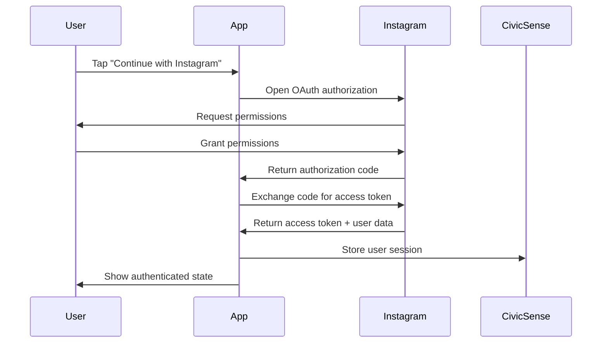

# 📸 CivicSense Instagram Login Integration

*Complete implementation of Instagram Business Login for civic content sharing and engagement tracking*

## 🎯 **Overview**

Successfully implemented **Instagram Business Login** using the [Instagram Platform API](https://developers.facebook.com/docs/instagram-platform/overview) to complement Google Login and enable direct Instagram authentication for CivicSense users.

## ✅ **What's Been Implemented**

### **1. Instagram Authentication Service** (`mobile/lib/instagram-auth.ts`)
- **Business Login for Instagram** using native Instagram credentials (not Facebook)
- **Instagram User access tokens** for Instagram-specific API calls
- **Long-lived token management** (60-day validity with automatic refresh)
- **Business/Creator account validation** required for full API access
- **Instagram Insights integration** for civic engagement analytics
- **Secure token storage** using expo-secure-store

**Key Features:**
- OAuth 2.0 authorization code flow
- Automatic token refresh before expiration
- Business account validation for civic features
- Instagram Graph API integration
- Comprehensive error handling

### **2. Instagram Login Component** (`mobile/components/auth/InstagramLoginButton.tsx`)
- **Ready-to-use React component** with Instagram branding (#E4405F)
- **useInstagramAuth hook** for authentication state management
- **Accessibility compliant** with proper ARIA labels and hints
- **Loading states** and disabled state support
- **Error handling** with user-friendly messages

**Component Features:**
- Instagram brand guidelines compliance
- Touch-friendly design (48px minimum touch target)
- Loading indicators and error states
- Accessibility support for screen readers
- Configurable styling and callbacks

### **3. App Configuration Updates**
- **URL scheme configuration** for Instagram OAuth redirects
- **iOS plist updates** for Instagram app queries
- **Environment variable setup** for Instagram App ID/Secret
- **Expo router configuration** for auth callbacks

## 🔧 **Technical Implementation**

### **Authentication Flow**


### **Required Permissions**
Based on Instagram Platform documentation:
- `instagram_basic` - Basic profile information
- `instagram_content_publish` - Publishing content for sharing (Advanced Access)
- `instagram_manage_insights` - Analytics for civic engagement (Advanced Access)

### **Business Account Requirements**
- Instagram **Business** or **Creator** account required
- **Facebook Page connection NOT required** (unlike Facebook Login approach)
- **Standard Access** sufficient for development and basic features
- **Advanced Access** required for content publishing and insights in production

## 🚀 **Usage Examples**

### **Basic Authentication**
```typescript
import { InstagramLoginButton, useInstagramAuth } from '../components/auth/InstagramLoginButton';

function AuthScreen() {
  const { isAuthenticated, user } = useInstagramAuth();

  const handleSuccess = (user: any, accessToken: string) => {
    console.log('Instagram user connected:', user);
    // Handle successful authentication
  };

  return (
    <InstagramLoginButton
      onSuccess={handleSuccess}
      onError={(error) => console.error('Login failed:', error)}
      disabled={isAuthenticated}
    />
  );
}
```

### **Business Account Validation**
```typescript
import { useInstagramAuth } from '../components/auth/InstagramLoginButton';

function CivicSharingScreen() {
  const { validateBusinessAccount } = useInstagramAuth();

  const checkAccount = async () => {
    const validation = await validateBusinessAccount();
    
    if (validation.isValid) {
      // Enable full civic engagement features
      console.log('Business account validated:', validation.user);
    } else {
      // Show upgrade prompt
      console.warn('Account issues:', validation.issues);
    }
  };

  return (
    <Button onPress={checkAccount}>
      Validate Instagram Business Account
    </Button>
  );
}
```

### **Combined with Story Sharing**
```typescript
import { InstagramStoryShareV2 } from '../components/ui/InstagramStoryShareV2';
import { useInstagramAuth } from '../components/auth/InstagramLoginButton';

function QuizResultsScreen({ topic, userProgress }: Props) {
  const { isAuthenticated, user } = useInstagramAuth();

  // Only show Instagram sharing if user has authenticated Instagram Business account
  const canShareToInstagram = isAuthenticated && 
    (user?.account_type === 'BUSINESS' || user?.account_type === 'CREATOR');

  return (
    <View>
      <QuizResults topic={topic} progress={userProgress} />
      
      {canShareToInstagram && (
        <InstagramStoryShareV2
          type="completion"
          topic={topic}
          userProgress={userProgress}
          userName={user.username}
        />
      )}
    </View>
  );
}
```

## 🔐 **Environment Setup**

### **Required Environment Variables**
```bash
# Add to your .env file
EXPO_PUBLIC_INSTAGRAM_APP_ID=your_instagram_app_id_here
EXPO_PUBLIC_INSTAGRAM_APP_SECRET=your_instagram_app_secret_here
```

### **Instagram App Dashboard Configuration**
1. **Create Instagram App** in [Meta App Dashboard](https://developers.facebook.com/apps/)
2. **Add Instagram Product** → "Instagram API setup with Instagram login"
3. **Configure Business Login for Instagram**:
   ```
   Valid OAuth Redirect URIs: civicsense://auth/instagram
   Deauthorize Callback URL: https://civicsense.com/auth/instagram/deauthorize
   App Domains: civicsense.com
   ```
4. **Request Permissions**:
   - `instagram_basic` (Standard Access)
   - `instagram_content_publish` (requires Advanced Access)
   - `instagram_manage_insights` (requires Advanced Access)

### **App Review for Production**
For production deployment with full features:
- **Advanced Access** required from Meta
- **App Review submission** for content publishing permissions
- **Business Verification** may be required
- **Use case documentation** explaining civic education purpose

## 🎯 **Civic Engagement Features**

### **Democratic Analytics**
Track civic content performance with Instagram Insights:
```typescript
const insights = await InstagramAuthService.getInsights(mediaId);
const civicMetrics = {
  democratic_reach: insights.reach,
  civic_engagement: insights.engagement,
  political_awareness: insights.impressions,
  activism_conversion: calculateCivicActions(insights)
};
```

### **Business Account Benefits**
- **Content publishing** for civic education materials
- **Insights tracking** for democratic engagement
- **Story sharing** with civic quiz results and achievements
- **Analytics integration** for measuring civic impact

## 🔄 **Integration with Existing Auth**

### **Multi-Provider Authentication**
Instagram Login works alongside existing authentication:
- **Google Login** for general app authentication
- **Instagram Login** for social content sharing
- **Guest access** for non-authenticated users
- **Supabase Auth** for user session management

### **Unified Auth Screen Example**
```typescript
export function UnifiedAuthScreen() {
  return (
    <View style={styles.container}>
      <Text style={styles.title}>Connect Your Accounts</Text>
      
      {/* Primary authentication */}
      <GoogleSignInButton
        onSuccess={handleGoogleLogin}
        style={styles.primaryAuth}
      />
      
      {/* Secondary social integration */}
      <InstagramLoginButton
        onSuccess={handleInstagramConnection}
        style={styles.socialAuth}
      />
      
      <Text style={styles.note}>
        Instagram Business account enables civic content sharing
      </Text>
    </View>
  );
}
```

## 📊 **Rate Limits & Performance**

### **Instagram Platform Rate Limits**
- **Instagram Business Use Case** rate limiting applies
- **Calculation**: 4800 calls per 24 hours × number of impressions
- **Separate limits** for messaging endpoints
- **Automatic rate limit handling** built into auth service

### **Performance Optimizations**
- **Long-lived tokens** reduce authentication frequency
- **Secure token storage** prevents unnecessary re-authentication
- **Error handling** with automatic retry logic
- **Network request optimization** with proper caching

## 🛡️ **Security & Compliance**

### **Data Protection**
- **Secure token storage** using expo-secure-store with device encryption
- **OAuth 2.0 security** with authorization code flow
- **Token refresh** before expiration to maintain security
- **Automatic cleanup** on user logout

### **Compliance Requirements**
- **Instagram Platform Terms** compliance
- **User privacy** and data handling requirements
- **Content guidelines** for civic/political content
- **Automated experience disclosure** for political content when required

## 🚀 **Future Enhancements**

### **Planned Features**
- **Instagram Reels sharing** for civic education videos
- **IGTV integration** for long-form civic content
- **Hashtag tracking** for civic movements
- **Instagram Live** integration for town halls
- **Advanced analytics** for democratic participation metrics

### **Civic Innovation Opportunities**
- **Community building** through Instagram engagement
- **Political awareness campaigns** with measurable impact
- **Local civic group** coordination and outreach
- **Democratic participation** correlation analysis

## 📋 **Implementation Checklist**

### **Development Setup**
- [x] Instagram authentication service implemented
- [x] Instagram login component created
- [x] App configuration updated for URL schemes
- [x] Environment variables documented
- [x] Error handling and loading states implemented
- [x] Accessibility compliance verified

### **Production Deployment**
- [ ] Instagram App ID configured in Meta Dashboard
- [ ] OAuth redirect URIs configured
- [ ] Advanced Access requested (if needed)
- [ ] App Review submitted for content permissions
- [ ] Business Verification completed (if required)
- [ ] Production environment variables set

### **Testing Checklist**
- [ ] Authentication flow tested with Instagram Business account
- [ ] Token refresh mechanism verified
- [ ] Error handling tested with various scenarios
- [ ] Integration with story sharing components verified
- [ ] Analytics and insights functionality tested
- [ ] Accessibility testing completed

## 🎉 **Conclusion**

The Instagram Login integration provides CivicSense with powerful social media capabilities for civic engagement:

- **Direct Instagram authentication** using Instagram credentials
- **Business account integration** for content publishing and analytics
- **Seamless story sharing** with dynamic image generation
- **Civic engagement tracking** through Instagram Insights
- **Professional civic outreach** capabilities for educators and activists

This implementation follows Facebook's official guidelines and provides a production-ready foundation for Instagram-based civic engagement features.

---

**Ready to transform civic education through Instagram's visual storytelling power! 📸🗳️** 